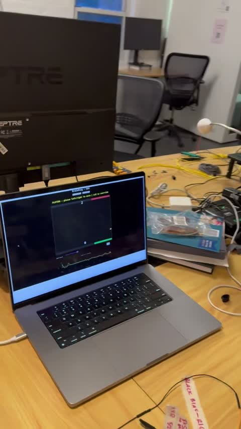

# BrainPong

Play Pong with your eyes. A 2-electrode horizontal **EOG** (electrooculography) setup reads
left/right eye movements off a [Cerelog X8](https://cerelog.com) and drives the paddle in real time.
The setup is receive-only — it measures the small natural voltages your eye movements produce on the
skin; nothing is ever sent back into the body.

<a href="assets/eye-pong-demo.mp4"></a>

## How it works

```
Cerelog X8 → 2-ch horizontal EOG → differential (ch_R − ch_L)
  → detrend / bandpass / notch → glance-pair detector → {LEFT, RIGHT, NEUTRAL} → paddle
```

A *glance pair* is the saccade out + return saccade of a deliberate look; the detector keys on that
signature rather than raw amplitude, which keeps it robust to drift.

## Layout

- `src/brainpong/` — importable library: `eog_core` (realtime glance-pair detector), `preprocess`, `detect`, `store` (viewer SQLite + npz decimation).
- `scripts/` — runnable entrypoints (game, recorder, eval, plots, viewer server + ingest).
- `web/` — the EOG diagnostic viewer frontend (static HTML/CSS/canvas, talks to the viewer API).
- `data/eog/` — labeled EOG sessions (`eog-v1`/`eog-v2`/`eog-v3`). Read-only ground truth; never mutated.
- `derivatives/` — regenerable outputs (`derivatives/results/` = benchmark JSON; `viewer.db` = viewer store, gitignored).
- `archive/` — prior SSVEP pong work. Reference only; superseded by the EOG approach.

## Key files

**Live game**
- `scripts/pong_game_brainflow.py` — the game (Dash app). Modes: `--no-board` (keyboard), `--eog` (1-player), `--2player`.
- `src/brainpong/eog_core.py` — shared realtime glance-pair detector; single source of truth for 1- and 2-player paths.
- `scripts/record_eog.py` — cued LEFT/RIGHT/REST recorder → labeled `.npz` for training/eval.
- `scripts/filtered_plot.py` — live scrolling plot of the board signal (are the electrodes alive?).

**Offline eval pipeline**
- `src/brainpong/preprocess.py` — `npz → PrepResult` (filtering / normalization variants).
- `src/brainpong/detect.py` — `PrepResult → DetectResult` (accuracy, latency, false-positive rate).
- `archive/eog-scripts/bench.py` — runs the preprocessor × detector grid over all recordings → JSON in `derivatives/results/`.
- `archive/eog-scripts/eval_simple.py`, `archive/eog-scripts/eval_classifier.py` — standalone classifier evals (peak-sign; leave-one-subject-out z-threshold).
- `archive/eog-scripts/plot_recording.py`, `plot_trials.py`, `plot_subjects.py` — visualization.

  (These offline-eval/plot scripts were archived to `archive/eog-scripts/` when focus shifted to the live game; run them from that path.)

**Diagnostic web viewer**
- `src/brainpong/store.py` — SQLite store: ingests the frozen npz (metadata, events, trims), serves min/max-decimated signal. The npz stay the source of truth; the DB (`derivatives/viewer.db`) is a regenerable derivative.
- `scripts/ingest_npz.py` — build/refresh the viewer DB from `data/eog/`.
- `scripts/serve_viewer.py` — Flask API + static host for `web/`.
- `web/` — two-zone viewer: derived **L−R ribbon** over the **raw electrode channels**, per-filter overlay (`Raw` / `0.5–30` / `0.1–30` / velocity), a draggable **keep-window trim** (gates ribbon + FFT + stats; raw stays full), and a problems-first recording list. Trims persist as DB annotations — **never** written back to the npz. Verbose, leveled frontend logging traces lifecycle / interactions / API calls into an in-memory ring buffer at `window.__eoglog` (append `?debug=1` to surface the granular trace in the console).

## Running it

```bash
source .venv/bin/activate          # project-local venv (Python 3.13)
pip install -e .                   # once: makes `brainpong` importable

python scripts/filtered_plot.py                  # check the signal is alive
python scripts/record_eog.py --subject me        # record labeled gaze data
python archive/eog-scripts/bench.py              # eval pipelines against all recordings

python scripts/pong_game_brainflow.py --no-board   # keyboard only, no hardware
python scripts/pong_game_brainflow.py --eog        # 1-player EOG (needs board)
python scripts/pong_game_brainflow.py --2player    # 2-player EOG (two boards, one per player)
```

**Diagnostic web viewer** (no board needed — reads the committed recordings):

```bash
python scripts/ingest_npz.py       # build derivatives/viewer.db from data/eog/
python scripts/serve_viewer.py     # http://localhost:8770
```

Re-run `ingest_npz.py` after adding recordings. The viewer needs only `flask`
(+ numpy/scipy); no brainflow fork required.

Hardware modes need Cerelog's BrainFlow fork (provides `CERELOG_X8_BOARD`), not upstream PyPI brainflow:

```bash
pip install -e /path/to/Shared_brainflow-cerelog/python_package
```
